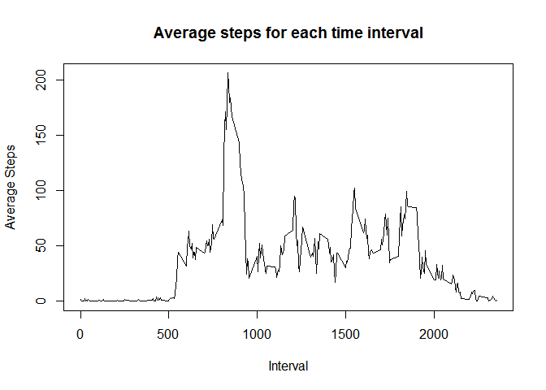

# Reproducible Research: Peer Assessment 1


## Loading and preprocessing the data
First let's read the data:

```r
  activity <- read.csv("activity.csv")
  activity$date <- strptime(activity$date, format="%Y-%m-%d")
  summary(activity)
```

```
##      steps             date                        interval     
##  Min.   :  0.00   Min.   :2012-10-01 00:00:00   Min.   :   0.0  
##  1st Qu.:  0.00   1st Qu.:2012-10-16 00:00:00   1st Qu.: 588.8  
##  Median :  0.00   Median :2012-10-31 00:00:00   Median :1177.5  
##  Mean   : 37.38   Mean   :2012-10-31 00:25:34   Mean   :1177.5  
##  3rd Qu.: 12.00   3rd Qu.:2012-11-15 00:00:00   3rd Qu.:1766.2  
##  Max.   :806.00   Max.   :2012-11-30 00:00:00   Max.   :2355.0  
##  NA's   :2304
```


## What is mean total number of steps taken per day?

```r
  steps_by_day <- rowsum(activity$steps, format(activity$date), na.rm=TRUE)
  hist(steps_by_day, breaks=20, xlab="Steps", main="Histogram of Daily Steps")
```

 

```r
  mean_steps_per_day <- mean (steps_by_day)
  mean_steps_per_day
```

```
## [1] 9354.23
```

```r
  median_steps_per_day <- median (steps_by_day)
  median_steps_per_day
```

```
## [1] 10395
```

## What is the average daily activity pattern?

```r
  steps_by_interval <- tapply(activity$steps,activity$interval,FUN=mean, na.rm=TRUE)
  plot(labels(steps_by_interval)[[1]],steps_by_interval,type="l",xlab="Interval", ylab="Average Steps",main="Average steps for each time interval")
```

 

### What interval averages the most steps?

```r
  most_steps_interval <- labels(which.max(steps_by_interval))
  print (most_steps_interval)
```

```
## [1] "835"
```

## Imputing missing values

### How many missing values are there in the dataset?

```r
  sum(is.na(activity))
```

```
## [1] 2304
```

### replacing missing values with daily average for that interval

```r
  imputed_activity <- activity
  ind <- which(is.na(imputed_activity$steps))
  imputed_activity$steps[ind] <- steps_by_interval[as.character(imputed_activity$interval[ind])]
  sum(is.na(imputed_activity))
```

```
## [1] 0
```

```r
  steps_by_day <- rowsum(imputed_activity$steps, format(imputed_activity$date), na.rm=TRUE)
  hist(steps_by_day, breaks=20, xlab="Steps", main="Histogram of Daily Steps (with missing data imputed)")
```

 

```r
  median(steps_by_day)
```

```
## [1] 10766.19
```

```r
  mean(steps_by_day)
```

```
## [1] 10766.19
```

### What is the impact of imputing missing data on the estimates of the total daily number of steps?
Imputing missing data raises the mean and median

## Are there differences in activity patterns between weekdays and weekends?

```r
  library(lattice)
  days_of_week <- weekdays(imputed_activity$date, abbreviate=TRUE)
  imputed_activity$weekday <- "Weekday"
  imputed_activity$weekday[(days_of_week=="Sun")|(days_of_week=="Sat")] <- "Weekend"
  steps_by_interval2 <- aggregate(steps ~ interval+weekday, imputed_activity, mean)
  xyplot(steps_by_interval2$steps~steps_by_interval2$interval|steps_by_interval2$weekday,t="l",layout=(c(1,2)),xlab="Interval", ylab="Steps", main="Average steps per interval for Weekdays and Weekends")
```

 
